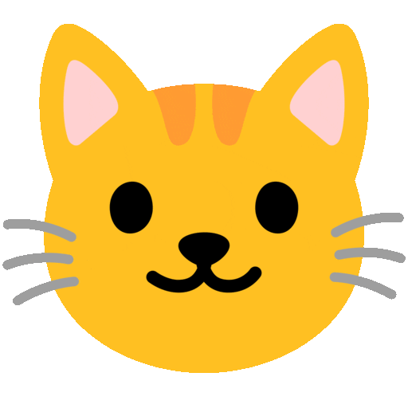

# Hey, I'm Tobias 

Currently a high school student studying computer science, building projects along the way.
  
Feel free to check out my repositories! 
## About Me:
I'm still learning and experimenting with different things, mostly by building small projects.
## Tech:
  
## GitHub Stats:

   
   
  

### Top Contributed Repo

---

